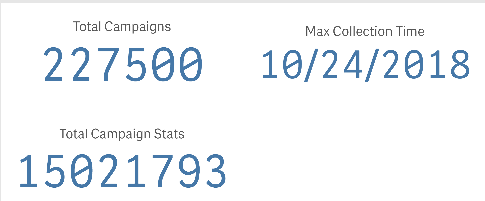

# Qlik Sense Eval
:docinfodir: ../../../docinfo
:docinfo: shared

## 1. Load Hive Data

### 1.1 Setup Hive Connection

No issues.  Pretty straightforward.

### 1.2 Load Simple Hive tables - deduplicated data, < 200k rows

I took some of our simplest use cases and tried to load them into the tool.

Using Data Manager, got an error:

With a modal behind it:

#### 1.2.1 Attempt turning off Data Profiling

Turning off data profiling looked promising.  After loading for a while it said it had successfully loaded the data with 1 synthetic key to be checked.  However, I had left the tab for too long and when I got back it said it needed a refresh.  Upon refresh my table was not present.  After retrying, the MetaException from above was displayed behind the success modal.  The Data Manager then presented this:

#### 1.2.2 Attempt loading through Data Load Editor

I was able to pretty easily generate a script to load this data, and running the load was successful. This resulted in a table not managed by Data Manager.

NOTE: Would like to know more about the trade-offs between having a table managed by Data Manager vs not having it managed

I saw the Data Load Editor has a pretty slick debugging mechanism.  Looked like I could add breakpoints and limits in there to test my scripts.  That was great, I was using it and it behaved as expected.

NOTE: Can you run a single script, or subset of scripts in the debugger?

### 1.3 Load Medium Sized Hive table - duplicated data, 

Attempting to load this table through the Data Manager failed with the same error as the others, so I attempted right away to do it through the script editor.  I was running it for a couple of hours at the office, and then I had to close my laptop and leave.  It had only gotten through loading about 60 million rows in 2 hours.

I figured I'd just let it run over night and see where it was in the morning.  Unfortunately coming into the system the next day, there was no indication that I had ran any load.  No error save perhaps a warning symbol on the top of the Data Manager.  

NOTE: At this point, I tried to find loading logs.  I found ServerLogs as a data source in the manager, but since there is no way to sort them by time, I couldn't find the proper log to load.  It seems like the loading logs would be in the ServerLogFolder/Script.  If I was able to load all the files in there at once it seems I'd be able to query perhaps?  Are there any better ways of seeing loading logs in the UI?   What is the best place to find out if a load failed?

## 2. Incremental Load

After meeting up with the team and getting some insight into how Qlik functions at a deeper level, I decided to go ahead and try to implement a sample incremental load with the twitter campaign + stats data.  

### 2.1 Campaign Load (Full Refresh)

* The first dataset, the campaign dimension table loaded without issue.
* However it seemed to generate SQL that was invalid for Hive? I was confused by this
because the data still loaded.  I saw it as an error in the Hive console though.

### 2.2 Campaign Stats Load (Incremental Refresh)

#### 2.2.1 Initial Load

* The initial load was failing, it turned out to be a timeout issue, but the error message was poor

#### 2.2.2 Incremental Load

* While after importing the initial data, the collection_dt column was detected as a Date, the same wasn't true for the Resident LOAD table in the incremental script
* This effort was frustrated by the fact that it's difficult to see what's in a Resident LOAD table from the UI.  You can write one to disk, but I don't have access to the local box that it's set up on.  It would be nice to have a debugging feature where you can preview a resident table and run queries on it.

## 3. Conclusion

### The Good

* I like the capabilities of the scripting editor.  It felt like a natural environment to code a data load in.
* I think I have an understanding of how to scale the system, using apps as data partitions.  It makes sense logically to me, and it gives a nice, easy to understand encapsulation/integration point with your data.
* I like the way that it can balance load amongst disparate QlikSense servers.  Basically shuffling apps to load to the server that has less load.  And the fact that a single app's memory can be shared by multiple users.
* Synthetic Keys that are auto-generated by name matching is simple and intuitive.
* I was pretty easily able to figure out how to add sheets, and to work with the UI.  The UI was pretty intuitive in general.

### The Meh

* I found performance of the app to be middling. (NOTE: after logging into the server and using the UI locally, it had great performance.  This might have been caused by going through the VPN)
* I like the scripting capabilities of the Data Load Editor.  But it's quirky and it really is a skill unto itself to learn. Being familiar with SQL definitely helps, but it's not really intuitive how the language works.  The debugging features could use some help as well.
* At some point I lost a load because I loaded up my DB with a debugging LOAD LIMIT.  Definitely user error, but something really easy to do with the script load editor.
* Synthetic Keys that are auto-generated by name matching could be limiting, and cause us to have to choose unnatural names.

### The Bad

* The constant Connection Lost errors were more than just annoying when you're running long-running loads.  They cause the screen to lock up and I've lost work more than once because of them
* I found some things that caused me concern for query performance.  I have a ~15 mil row table and getting the max date from that table took 15+ minutes.  This was consistent, and it was even after the data was loaded into memory.  I was able to optimize my queries around it and make it super fast, but I was still suprised at the time it took.
