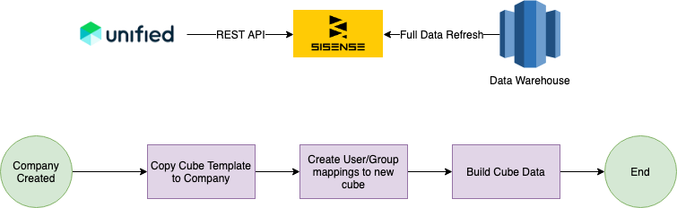
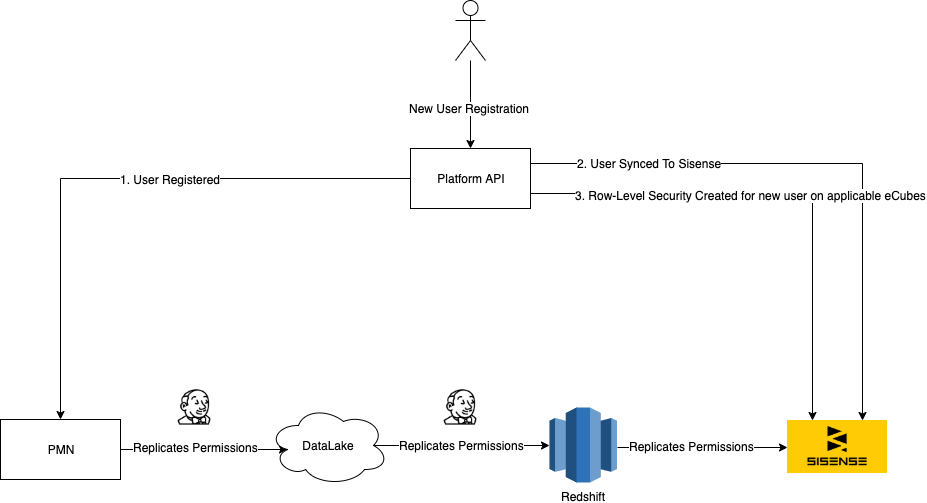

# Sisense Dashboard Scaling
John Nadratowski <john@unified.com>
:docinfodir: ../../docinfo
:docinfo: shared,private
:toc: preamble
:icons: font
:sectnums:

In order to make our business more scalable, an effort has been put in to research how to alleviate the manual processes around creation of Sisense dashboards. 
In that vein we have identified #three# potential solutions for our scaling concerns.

## Shared ElastiCubes with Row-Based Data Security

This is commonly referred to as the `Multi-Tenancy` solution.  All customers share a cube and row-level access security restrictions are placed on the cube.

.Shared ElastiCubes with Row-Based Data Security Pros And Cons
|===
|[.pros]#Pros#|[.cons]#Cons#
|Only need to build cube once for all clients|Cube size may force vertical scaling
|Only need to build dashboards once for all customers|Cannot customize dashboard for a single customer
|Maintenance of data/dashboard changes is easier, as there is only one place to update|Having to manage row-level security as an extension of our security model is added complexity
|Higher resource utilization|Tenants may affect each other's performance
|===

### Q & A w/Sisense

Any other scaling options for this strategy besides vertical?::
  You can partition by customer multi-tenant, though, that shares the limitations of 
  <<Dedicated Cube per Tenant>>.
How do we handle updating row-level security on user changes (removal/addition/etc)? Can this be done through the API?::
  Yes, you can handle row-level security changes through the API.  You can have a mapping table for users to their permissions, and give them access to that table through row-level security.
Are there any options for customizing a single customer's dashboard?::
  Besides creating a different cube and mapping the customer to it, no.
Building a massive cube for all of our customers may be prohibitively time-consuming given our restraints (we need to recollect data on days, so updating rows, and setting up row-level access constraints).  Is there some way to scale this process?::
  In an upcoming release of Sisense, it will support UPSERTs, which will alleviate this issue.

## Dedicated Cube per Tenant

This is the closest strategy to what we currently employ.  We have a customer and we create a cube dedicated to their dashboards. 

.Dedicated Cube per Tenant Pros And Cons
|===
|[.pros]#Pros#|[.cons]#Cons#
|Mostly matches what we do today|Need to create infrastructure to curate cubes per customer
|Allows us to easily customize per-customer|Means we will have to update each cube manually on data changes
|Data partitioned by customer is more easily horizontally scalable|Limited number of cubes per machine
|No need to manually manage row-level security|Higher levels of change control needed per-cube (what was customized on each cube)
|Easily parallelize cube creation across customers|
|===

'''

.Architecture Workflow

### Q & A w/Sisense
How many cubes can you have per machine?::
  40 ecubes/machine windows, 200 ecubes/machine linux, 400 nodes for live ecubes on linux.
Is there a way to build elasticubes through the API?::
  Yes
Is there a way to stagger scheduled builds so they don't all happen at once?::
  Yes
What are our options for scaling the building process? More Sisense servers?::
  The upcoming version of Sisense with UPSERT functionality should alleviate this concern
Is there a way to copy a base cube to use as a template when onboarding new customer?::
  Yes
Do we have to determine the server to copy the base template cube to through the API?::
  Yes
Are there any tools or processes to facilitate changes across customized cubes?::
  There is a plugin called https://www.sisense.com/marketplace/dynamic-elasticubes/[Dynamic Elasticubes] which can share a single dashboard across disparate client cubes.

<<<

## Live Cubes With User Filtering

This is the only strategy not listed in the https://documentation.sisense.com/latest/administration/embedded-analytics/oemarch.htm#gsc.tab=0[OEM Architecture] document.  In this strategy, we would not generate data in Elasticubes for customers at all, but do a live cube, pointing at our own DB. [.line-through]#We would have to pass through the user's ID in JAQL filters for all of our components.# We would set up row-level security for each user in the cube.

.Live Cubes With User Filtering Pros And Cons
|===
|[.pros]#Pros#|[.cons]#Cons#
|We can easily scale our own DBs|Customer database tables cannot be customized without much effort
|No need to have cube generation infrastructure|Still need to implement row-level security
|We can leverage our current transformation pipeline to create novel reports|Live cubes are still missing a small amount of features
|===

### Q & A w/Sisense
Can you pass a user's ID through JAQL?::
  No, you use row-level security with custom models in live.  Custom models in live has already arrived and Unified can upgrade to it.
How many live cubes can you have per machine?::
  400 (answered above).
Are there features that we'd be missing from the dashboards using only Live cubes?::
  There are three features that we'd miss in live ecubes: Running Sum, Running Averages, and Rank Functions.  Also, the box and whisker plots.

## Analysis

Out of the three options, a combination of <<Shared ElastiCubes with Row-Based Data Security>> and <<Live Cubes With User Filtering>> seem to be able to support the broadest range of possible dashboards while minimizing implementation time to support.  Shared Elasticubes (multi-tenancy) will work well for small sized dashboards where we can co-locate all of our users data without fear of hitting upper bound limits of the size of the elasticubes.  Live cubes work well for dashboards that depend on vast amounts of data, as we no longer have to worry about scaling elasticubes and the Sisense servers.

### Implementation

They also share the same challenges in terms of implementation: setting up row-level security.  In order to test this, I've created https://prod-0002-elb-sisense.unified.com/app/main#/dashboards/5d978ec73f6d3423300183fe/[an example dashboard] detailing how this can work.  The good part is, a decent amount of work has already been done to support this, as we have tables in Redshift where we can derive access permissions to LineItems and Brands.  However, I've found certain cases where this is lacking (issues in the lineitem_permission table, missing way of mapping user and brand access reliably) where we'd have to do some implementation.

In addition, we'd have to set up an automated way of updating the row-level security when new users are added to the system.  See the figure below:

.Row-Level Security Automation

This is imperfect, but portrays what needs to be done properly.  When a new user is created and synced to Sisense, we also need to create them new row-level security permissions in each applicable elasticube.  I believe the best way of doing this is to use an event-based architecture that puts an event on a stream when a user is created, then a Jenkins job is configured to read the stream and do the proper processing.  This is different from our current architecture which just makes a simple Sisense API call at the time of registration.  That is because, we would now need some respository where we store the ecubes that need their security updated, necessitating a more sophisticated architecture.  

NOTE: If Sisense gives the ability to generate row-based security at build-time, then that is a better option. However, I have not seen this functionality presented. This will be discussed with Sisense consulting.

We would continue to manage the cube building process in Sisense and staggering our builds.  This will be greatly improved with the upcoming Sisense releases allowing for UPSERTS.  This will cut down the building time drastically and will allow us to have a viable full multi-tenancy solution, when applicable.  Some problems are better suited to more "low-tech" solutions: I would just set up the staggered builds in Sisense and manage it with a Google Sheet.

Since we will be utilizing Live Elasticubes much more, the onus of data processing is moved to our internal databases.  Sisense has recommended that we move to a 3 node cluster at a cost of $60K USD.  While this would provide us with better uptime, I believe this ultimately unnecessary as our databases are already redundant and able to handle the load without extra Sisense servers.

### What's Missing

The only use cases that this doesn't cover are when we have dashboards backed by very large datasets that need to utilize a function that Live Cubes do not support.  The only functions that they do not support currently are:

 * Running Sum
 * Running Averages
 * Rank Functions
 * Box Plots
 * Whisker Plots

While we may not be able to use Box or Whisker plots, we should be able to get around not having Running Sum, Running Average, and Rank functions by just doing additional transformations in our Data Pipeline.  I believe that this is enough coverage to not worry much about missing these features moving forward.

## Conclusion

* We will implement automation of row-level security automation for Elasticubes
* We will start using <<Shared ElastiCubes with Row-Based Data Security>> for common client dashboards that have datasets capable of being handled by a single Elasticube, when they come out with UPSERT functionality
* We will use <<Live Cubes With User Filtering>> when we have common client dashboards that have datasets a single Elasticube cannot easily handle.
* We will keep our current Sisense subscription, upgrade to Linux, and upgrade Sisense to get UPSERT functionality